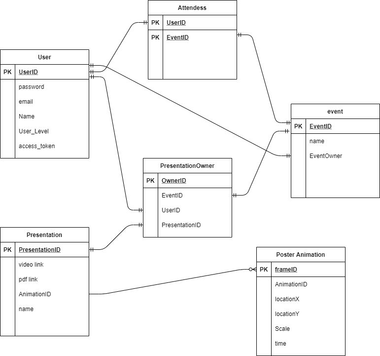

# Development Environment

tools local

- nodejs (v14.16.0)
- MySQL Community (v8.0.22) - Used for local testing of the database

## backend

setup

- make sure to install nodejs (https://nodejs.org)

### How to start the server

In the commandline go to the backend folder 

start server ```node app.js```


### Setting up backend and frontend connection

With in the backend folder you need to change the `BACKEND_DOMAIN=http://localhost:3300` to the address and port of you frontend server to allow the backend to communicate with the frontend or else you will get a cors error.

### Setting up datebase



For local development you can use mySQL workbench as a sql server - https://www.mysql.com/products/workbench - (v8.0.22)

The SQL schema can be found in `./virtual-poster/MySQL/database_schema.sql` this is the SQL code that can be used to setup the mysql schema

**importent** The mysql database system will have to be in **legacy authentication mode**

how to change mysql workbench to legacy authentication mode

- executing the mysql install file
- select "Reconfigure" over the mysql server
- In Authentication Method tab, select "Use Legacy Authentication Method"

With in backend folder you need to change the given value below found in the `.env` file to ones used by your mysql database. 

- `DB_HOST=` will need to be the ip of your database
- `DB_USER=` will need to be the user you have setup in the database to be the access user
- `DB_PASS=` this will be the user password that is used for the mysql user account
- `DB_DATABASE=` will need to be set to the database you are accessing with in the mysql system

```
DB_HOST=127.0.0.1
DB_USER=root
DB_PASS=password
DB_DATABASE=database
```

# API ref

## authentication

### Login

#### request

```
POST http://domainName/auth/login

{
    "email": "data",
    "password": "data"
}
```

#### Response

return type json

- if the password is wrong will return `password: bad` but if the password is ok it will return `password: good`
- if there is no user with that email it will return `email: bad` but if there is an email it will return `email: good`

example of reponse json body where the user logs in.

```
{
  "email": "good",
  "password": "good"
}
```

### Register

#### Request

http Request to create user

```
post http://domainName/auth/register
content-type: application/json

{
    "email": "admin1",
    "password": "admin"
}
```

#### Response

return type json

- if `"email": "bad"` then the email is in use, but if `"email": "good"` then the email is not been used and can be used
- if `"user_created": "no"` then no user was created, but if `"user_created": "yes"` then user has been created

An Example of json response where email is in use.

```
{
  "email": "bad",
  "user_created": "no"
}
```

### logout

API endpoint for logining the user out

#### Request

http Request to logout

```
post http://domainName/auth/logout
```

#### Response

if user loged out `"logout": "good"` but if there is no user to logout `"logout": "good"` is returned

successful logout Response json body

```
{
  "logout": "good"
}
```

user already logedout Response json body

```
{
  "logout": "no-login"
}
```

### Create Conference

#### request

```
post http://localhost:3000/conference/create
content-type: application/json

{
    "name": "name of event"
}
```

#### Response

Returns if the conference was created `"create": "good"` if there is an error with creating the conference then will return `{created: 'bad'}` 

Will return the ID of the new conference like this `"conferenceID": "5a3c5c6d-fde5-44f5-a9c5-8d85cf563d0`

```
{
  "create": "good",
  "conferenceID": "5a3c5c6d-fde5-44f5-a9c5-8d85cf563d0c"
}
```

### Update Conference

#### Request

- `name: name` should be the new name you want to update the conference with

- `conferenceID: id` should be the id of the conference you want to update 

```
post http://localhost:3000/conference/update
content-type: application/json

{
    "name": "new name",
    "conferenceID": "the id of the confernce"
}
```

#### Response

- `updated: value` **good** means it was updated, **no** means it did not update, **bad** means there is an error

- `exists: value`  **yes** means there was a value to update, **no** means there is no values updated

- `conferenceID: id` just returns the id of the conference that was updated

```
{
  "updated": "good",
  "exists": "yes",
  "conferenceID": "ca0d7c22-768b-49db-8250-321e12e1754d"
}
```
